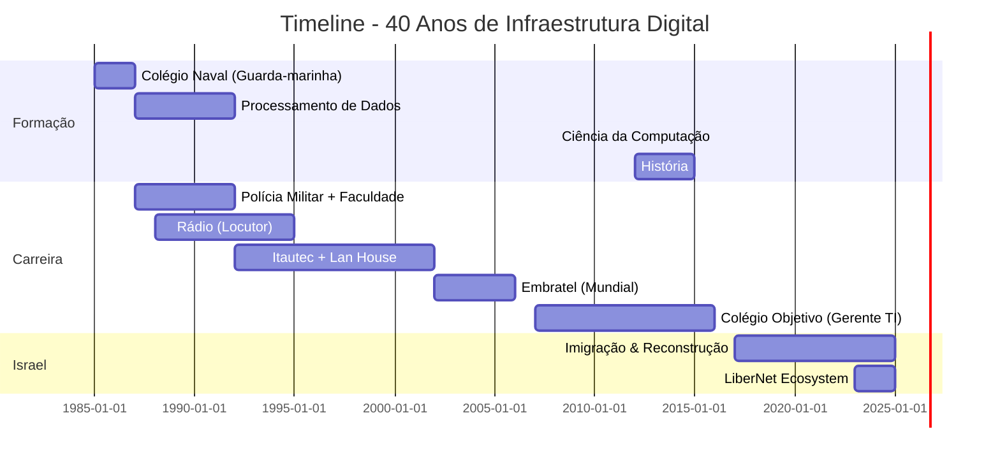

<div align="center">

<!-- HEADER SECTION -->


<h1 style="font-size: 3em; margin: 20px 0;">
  
</h1>

<p align="center">
  
  
  
  
</p>

<p align="center">
  <a href="https://njump.me/npub1nvcezhw3gze5waxtvrzzls8qzhvqpn087hj0s2jl948zr4egq0jqhm3mrr">
    
  </a>
  <a href="https://youtube.com/@lucianocasalunga">
    
  </a>
  <a href="https://twitter.com/LucianoBarak">
    
  </a>
  <a href="https://libernet.app">
    
  </a>
</p>

</div>

---

<!-- ABOUT SECTION -->
<table>
<tr>
<td width="50%" valign="top">

### 👨‍💻 Sobre Mim

```typescript
const barak = {
    nome: "Luciano Casalunga",
    aka: "Barak",
    idade: 57,
    localização: "Israel 🇮🇱",
    papel: "Arquiteto de Infraestrutura Digital",

    missao: "Construir a infraestrutura da liberdade digital",

    especialidades: [
        "Sistemas Descentralizados",
        "Infraestrutura de Telecomunicações",
        "Protocolos Nostr",
        "Bitcoin & Lightning Network",
        "DevOps & Cloud Architecture"
    ],

    filosofia: "Liberdade digital não é conceito — é infraestrutura"
};
```

</td>
<td width="50%" valign="top">

### 🎯 Quick Stats


</td>
</tr>
</table>

---

<!-- JOURNEY TIMELINE -->
<h2 align="center">🛤️ Jornada Profissional</h2>



<table>
<tr>
<td width="33%" align="center">

### 🎖️ 1985-1987
**Colégio Naval**
<br/>Guarda-marinha
<br/>Telecomunicações militares

</td>
<td width="33%" align="center">

### 🌎 2002-2006
**Embratel**
<br/>América Latina
<br/>Armênia, Marrocos

</td>
<td width="33%" align="center">

### 🇮🇱 2017-Hoje
**Israel**
<br/>LiberNet Ecosystem
<br/>8 anos de reconstrução

</td>
</tr>
</table>

---

<!-- TECH STACK -->
<h2 align="center">🚀 Tech Stack & Ferramentas</h2>

<div align="center">

### Languages & Frameworks


### Backend & Databases


### DevOps & Infrastructure


### Blockchain & Descentralização


### Frontend & Tools


</div>

---

<!-- PROJECTS SECTION -->
<h2 align="center">💼 LiberNet Ecosystem - Projetos em Produção</h2>

<table>
<tr>
<td width="50%">

<h3 align="center">🎥 LiberMedia</h3>
<div align="center">

[](https://github.com/lucianocasalunga/libermedia)

**Hospedagem Descentralizada de Arquivos**


`Nostr` `Lightning` `NIP-96` `Python` `PostgreSQL`

[🔗 Demo](https://media.libernet.app) | [📖 Docs](https://github.com/lucianocasalunga/libermedia)

</div>
</td>
<td width="50%">

<h3 align="center">🤖 Sofia</h3>
<div align="center">

[](https://github.com/lucianocasalunga/sofia-web)

**Primeira IA Nativa do Nostr**


`GPT-4o` `Nostr` `RAG` `ML` `Lightning`

[🔗 Demo](https://sofia.libernet.app) | [📖 Docs](https://github.com/lucianocasalunga/sofia-web)

</div>
</td>
</tr>
<tr>
<td width="50%">

<h3 align="center">💬 LiberChat</h3>
<div align="center">

[](https://github.com/lucianocasalunga/liberchat)

**Cliente Chat Nostr**


`NIP-04` `E2E Encryption` `PWA` `i18n`

[🔗 Demo](https://chat.libernet.app) | [📖 Docs](https://github.com/lucianocasalunga/liberchat)

</div>
</td>
<td width="50%">

<h3 align="center">⚡ LiberNet Relay</h3>
<div align="center">

[](https://github.com/lucianocasalunga/libernet-relay)

**Nostr Relay Customizado**


`Rust` `WebSocket` `High Performance`

[🔗 Relay](wss://relay.libernet.app) | [📖 Docs](https://github.com/lucianocasalunga/libernet-relay)

</div>
</td>
</tr>
</table>

---

<!-- EXPERIENCE SECTION -->
<h2 align="center">💼 Experiência Profissional</h2>

<details open>
<summary><b>🇮🇱 Atual - Israel (2017-2025)</b></summary>
<br/>

**Cargo:** Logística + Auxiliar Gerente de TI
**Projetos Pessoais:** LiberNet Ecosystem, YouTube (Israel Liber)
**Conquistas:**
- ✅ Reconstrução completa após tragédia pessoal
- ✅ Criação do ecossistema LiberNet (4 projetos em produção)
- ✅ Canal YouTube com conteúdo técnico (40 anos de experiência)
- ✅ Retorno à programação com IA (Python, JavaScript, Docker)

</details>

<details>
<summary><b>🏫 Colégio Objetivo de Tatuí - Gerente de TI (2007-2016)</b></summary>
<br/>

**Período:** Janeiro/2007 - Novembro/2016 (quase 10 anos)
**Responsabilidades:**
- 🔧 Gerenciamento completo da infraestrutura de TI
- 💻 Suporte a centenas de computadores e dispositivos
- 🌐 Redes, servidores, sistemas educacionais
- 👥 Gestão de equipe técnica

**Paralelo:**
- 💼 Consultoria TI (tardes): Posto 400, porto de areia, clínica, etc
- 🎓 Estudante: Ciência da Computação (2008), Programação (2010), História (2012-2015)
- 👨‍👧‍👦 Pai solo de 3 filhos

</details>

<details>
<summary><b>🌎 Embratel - Infraestrutura de Telecomunicações (2002-2006)</b></summary>
<br/>

**Período:** 2002-2006
**Escopo:** Internacional (América Latina, África, Ásia)
**Projetos:**
- 🌎 Implementação de infraestrutura em toda América Latina
- 🌍 Projetos em Venezuela, Armênia, Marrocos
- 📡 Telecomunicações de longo alcance
- 🛠️ Troubleshooting crítico em campo

**Aprendizado:** "O técnico invisível que conserta o impossível"

</details>

<details>
<summary><b>💻 Itautec + Empreendedor (1992-2002)</b></summary>
<br/>

**Itautec:** Suporte a servidores (projetos iniciais da empresa)
**Empreendimentos:**
- 🎮 Lan House (pioneiro no Brasil - era épica!)
- 💻 Balcão de informática (Eletrônica Santana)
- 🏪 Gestão de loja própria

**Resultado:** Quebrei por perseguição estatal aos fornecedores, mas aprendi que sistemas governamentais falham antes de sistemas técnicos.

</details>

<details>
<summary><b>🎓 Polícia Militar + Faculdade + Rádio (1987-1992)</b></summary>
<br/>

**Vida Tripla:**
- 👮 Polícia Militar de São Paulo (pagar a faculdade)
- 🎓 Faculdade de Processamento de Dados (Anhembi Morumbi)
- 📻 Locutor de Rádio (Rádio São Paulo, Mappin, Record)

**Lição:** Multitarefa não é opcional quando você vem de baixo.

</details>

<details>
<summary><b>⚓ Marinha do Brasil - Telecomunicações (1985-1987)</b></summary>
<br/>

**Instituição:** Colégio Naval
**Formação:** Guarda-marinha (19 anos)
**Aprendizado:**
- 📡 Radar, Sonar, Telex
- 📻 Rádio AM, FM, OC (comunicação tática)
- 🔧 Disciplina técnica e engenharia de precisão

**Saída:** Problemas de saúde, mas a tecnologia me levou ao mundo.

</details>

---

<!-- PHILOSOPHY SECTION -->
<h2 align="center">💭 Filosofia & Valores</h2>

<table>
<tr>
<td width="50%" align="center">

### 🎯 Missão

> *"Liberdade digital não é um conceito — é infraestrutura."*

Construir sistemas onde **todos podem ser soberanos**:
- 🔑 Suas chaves → Sua identidade (Nostr)
- ₿ Seu dinheiro → Seu controle (Bitcoin)
- 📁 Seus dados → Sua propriedade (Descentralização)

</td>
<td width="50%" align="center">

### 🛠️ Valores

```python
valores = {
    "codigo": "Que funciona > Que é bonito",
    "infraestrutura": "Resiliente, descentralizada, livre",
    "conhecimento": "Compartilhado abertamente",
    "credito": "Para quem faz, não quem fala",
    "filosofia": "Anarquista de coração, pragmático na execução"
}
```

</td>
</tr>
</table>

<div align="center">

### 📜 A História em Uma Frase

**"40 anos sendo o homem invisível por trás das máquinas que movem o mundo digital.<br/>Agora construindo a infraestrutura da liberdade para todos."**

</div>

---

<!-- LEARNING PATH -->
<h2 align="center">🎓 Formação Acadêmica & Certificações</h2>

<table>
<tr>
<td width="50%">

### 🎯 Formação

- 🎓 **Processamento de Dados** (Anhembi Morumbi, ~1992)
- 🎓 **Ciência da Computação** (2008)
- 💻 **Programação Avançada** (2010)
- 📚 **História** (2012-2015)
- ⚓ **Guarda-marinha** (Colégio Naval, 1985-1987)
- 📻 **Locução de Rádio** (anos 80/90)

</td>
<td width="50%">

### 🏆 Experiência Prática

**40 anos de:**
- ✅ Infraestrutura de Telecomunicações
- ✅ Administração de Sistemas
- ✅ DevOps & Cloud Architecture
- ✅ Desenvolvimento Full-Stack
- ✅ Gestão de TI Institucional
- ✅ Consultoria para empresas
- ✅ Ensino de Informática

</td>
</tr>
</table>

---

<!-- CONTENT SECTION -->
<h2 align="center">📺 Conteúdo & Comunidade</h2>

<div align="center">

### YouTube - Israel Liber

[](https://youtube.com/@lucianocasalunga)

**Conteúdo:**
- 🎥 Desenvolvimento de sistemas descentralizados
- ₿ Bitcoin e Lightning Network na prática
- 💜 Protocolo Nostr e NIPs
- 🇮🇱 Vida de imigrante tech em Israel
- 📚 40 anos de histórias da tecnologia

### Nostr - Rede Descentralizada

[](https://njump.me/npub1nvcezhw3gze5waxtvrzzls8qzhvqpn087hj0s2jl948zr4egq0jqhm3mrr)

**NIP-05:** `luciano@libernet.app`
**Relay:** `wss://relay.libernet.app`

</div>

---

<!-- GITHUB ACTIVITY -->
<h2 align="center">📊 GitHub Activity</h2>

<div align="center">


</div>

---

<!-- CONTACT SECTION -->
<h2 align="center">📬 Contato & Colaboração</h2>

<div align="center">

### 🌍 Onde Me Encontrar

<p>
  <a href="https://njump.me/npub1nvcezhw3gze5waxtvrzzls8qzhvqpn087hj0s2jl948zr4egq0jqhm3mrr">
    
  </a>
  <a href="https://youtube.com/@lucianocasalunga">
    
  </a>
  <a href="https://twitter.com/LucianoBarak">
    
  </a>
  <a href="mailto:luciano.casalunga@gmail.com">
    
  </a>
  <a href="https://libernet.app">
    
  </a>
</p>

### 🤝 Como Contribuir

Acredita em liberdade digital? Aqui está como você pode ajudar:

| Ação | Descrição |
|------|-----------|
| ⭐ **Star** | Dê uma estrela nos repositórios |
| 🐛 **Issues** | Reporte bugs e sugira features |
| 💻 **Code** | Contribua com código (PRs bem-vindos!) |
| ⚡ **Lightning** | Doe sats via [LiberMedia](https://media.libernet.app) |
| 💜 **Nostr Zap** | Envie zaps para `luciano@libernet.app` |
| 📺 **YouTube** | Inscreva-se e compartilhe |

</div>

---

<!-- FOOTER -->
<div align="center">


### 💭 *"Eu era aquele sujeito obscuro que ninguém sabe quem é,<br/>mas que faz com que as coisas aconteçam."*

**Do homem invisível por trás das máquinas ao construtor de ecossistemas descentralizados.**

**A jornada continua. Aos 57 anos e há 8 anos em Israel, estou apenas começando.**

---


**Construído com 💜 para um mundo mais livre**

<sub>Última atualização: Dezembro 2025 | Feito com Markdown + HTML + CSS + Muito ☕</sub>

</div>
