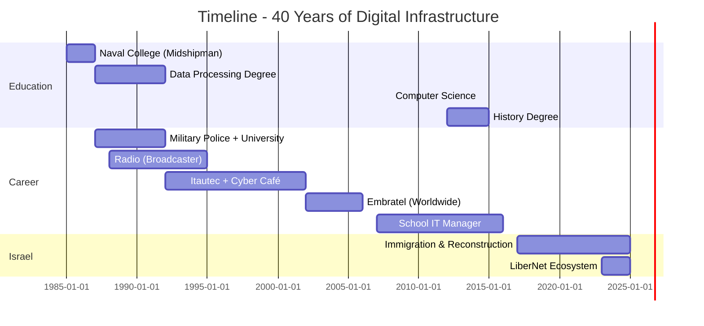

<div align="center">

<!-- HEADER SECTION -->


<h1 style="font-size: 3em; margin: 20px 0;">
  
</h1>

<p align="center">
  
  
  
  
</p>

<p align="center">
  <a href="https://njump.me/npub1nvcezhw3gze5waxtvrzzls8qzhvqpn087hj0s2jl948zr4egq0jqhm3mrr">
    
  </a>
  <a href="https://youtube.com/@lucianocasalunga">
    
  </a>
  <a href="https://twitter.com/LucianoBarak">
    
  </a>
  <a href="https://libernet.app">
    
  </a>
</p>

</div>

---

<!-- ABOUT SECTION -->
<table>
<tr>
<td width="50%" valign="top">

### 👨‍💻 About Me

```typescript
const barak = {
    name: "Luciano Casalunga",
    aka: "Barak",
    age: 57,
    location: "Israel 🇮🇱",
    role: "Digital Infrastructure Architect",

    mission: "Building the infrastructure of digital freedom",

    specialties: [
        "Decentralized Systems",
        "Telecommunications Infrastructure",
        "Nostr Protocol",
        "Bitcoin & Lightning Network",
        "DevOps & Cloud Architecture",
        "Linux Distribution Development"
    ],

    philosophy: "Digital freedom isn't a concept — it's infrastructure"
};
```

</td>
<td width="50%" valign="top">

### 🎯 Quick Stats

<div align="center">


</div>

</td>
</tr>
</table>

---

<!-- JOURNEY TIMELINE -->
<h2 align="center">🛤️ Professional Journey</h2>



<table>
<tr>
<td width="25%" align="center" valign="top">

### 🎖️ 1985-1987
**Naval College**
<br/>Midshipman Training
<br/>Military Telecommunications
<br/>Radar, Sonar, Radio Systems

</td>
<td width="25%" align="center" valign="top">

### 🐧 1990s-2000s
**Linux Pioneer**
<br/>Suse Linux Development
<br/>Kalango Linux Project
<br/>Open Source Contributor

</td>
<td width="25%" align="center" valign="top">

### 🌎 2002-2006
**Embratel**
<br/>Latin America, Africa, Asia
<br/>Radio Network Infrastructure
<br/>Fiber Optics & Telecom

</td>
<td width="25%" align="center" valign="top">

### 🇮🇱 2017-Today
**Israel**
<br/>LiberNet Ecosystem
<br/>8 Years of Reconstruction
<br/>Building Digital Freedom

</td>
</tr>
</table>

---

<!-- TECH STACK -->
<h2 align="center">🚀 Tech Stack & Tools</h2>

<div align="center">

### Languages & Frameworks


### Backend & Databases


### DevOps & Infrastructure


### Blockchain & Decentralization


### Frontend & Tools


</div>

---

<!-- PROJECTS SECTION -->
<h2 align="center">💼 LiberNet Ecosystem - Production Projects</h2>

<table>
<tr>
<td width="50%" valign="top">

<h3 align="center">🎥 LiberMedia</h3>
<div align="center">

[](https://github.com/lucianocasalunga/libermedia)

**Decentralized File Hosting**


`Nostr` `Lightning` `NIP-96` `Python` `PostgreSQL`

[🔗 Demo](https://media.libernet.app) | [📖 Docs](https://github.com/lucianocasalunga/libermedia)

</div>
</td>
<td width="50%" valign="top">

<h3 align="center">🤖 Sofia</h3>
<div align="center">

[](https://github.com/lucianocasalunga/sofia-web)

**First Nostr-Native AI**

_From Linux Sofia (1990s) to AI Sofia (2024)_


`GPT-4o` `Nostr` `RAG` `ML` `Lightning`

[🔗 Demo](https://sofia.libernet.app) | [📖 Docs](https://github.com/lucianocasalunga/sofia-web)

</div>
</td>
</tr>
<tr>
<td width="50%" valign="top">

<h3 align="center">💬 LiberChat</h3>
<div align="center">

[](https://github.com/lucianocasalunga/liberchat)

**Nostr Chat Client**


`NIP-04` `E2E Encryption` `PWA` `i18n`

[🔗 Demo](https://chat.libernet.app) | [📖 Docs](https://github.com/lucianocasalunga/liberchat)

</div>
</td>
<td width="50%" valign="top">

<h3 align="center">⚡ LiberNet Relay</h3>
<div align="center">

[](https://github.com/lucianocasalunga/libernet-relay)

**Custom Nostr Relay**


`Rust` `WebSocket` `High Performance`

[🔗 Relay](wss://relay.libernet.app) | [📖 Docs](https://github.com/lucianocasalunga/libernet-relay)

</div>
</td>
</tr>
</table>

---

<!-- EXPERIENCE SECTION -->
<h2 align="center">💼 Professional Experience</h2>

<details open>
<summary><b>🇮🇱 Current - Israel (2017-2025)</b></summary>
<br/>

**Role:** Logistics + IT Manager Assistant
**Personal Projects:** LiberNet Ecosystem, YouTube (Israel Liber)
**Achievements:**
- ✅ Complete reconstruction after personal tragedy
- ✅ Creation of LiberNet ecosystem (4 production projects)
- ✅ YouTube channel with technical content (40 years of experience)
- ✅ Return to programming with AI assistance (Python, JavaScript, Docker)

</details>

<details>
<summary><b>🏫 Colégio Objetivo de Tatuí - IT Manager (2007-2016)</b></summary>
<br/>

**Period:** January 2007 - November 2016 (almost 10 years)
**Responsibilities:**
- 🔧 Complete IT infrastructure management
- 💻 Support for hundreds of computers and devices
- 🌐 Networks, servers, educational systems
- 👥 Technical team management

**Parallel Activities:**
- 💼 IT Consulting (afternoons): Gas station, sand port, clinic, etc.
- 🎓 Student: Computer Science (2008), Programming (2010), History (2012-2015)
- 👨‍👧‍👦 Single father of 3 children

</details>

<details>
<summary><b>🌎 Embratel - Telecommunications Infrastructure (2002-2006)</b></summary>
<br/>

**Period:** 2002-2006
**Scope:** International (Latin America, Africa, Asia)

**Technical Training:**
- 📡 Long-distance radio network systems
- 🔌 Fiber optic cable installation and maintenance
- 🌐 Waveguide systems (pressurized cables)
- 📻 **Pioneer in radio-based internet implementation in Brazil**

**Projects:**
- 🌎 Infrastructure deployment across Latin America
- 🌍 Projects in Venezuela, Armenia, Morocco
- 📡 Long-range telecommunications systems
- 🛠️ Critical field troubleshooting

**Philosophy:** "The invisible technician who fixes the impossible"

</details>

<details>
<summary><b>💻 Itautec + Entrepreneur + Linux Developer (1992-2002)</b></summary>
<br/>

**Itautec:** Server support (company's early projects)

**Linux Contributions:**
- 🐧 **Suse Linux Development** - Worked with the team developing Suse Linux
- 🇧🇷 **Kalango Linux Project** - Participated in Brazilian Linux distribution development
- 💡 **Linux Sofia Concept** - Early idea that evolved into Sofia AI (2024)
- 💻 Open source community involvement

**Entrepreneurship:**
- 🎮 Cyber Café (pioneer in Brazil - legendary!)
- 💻 Computer retail (Eletrônica Santana)
- 🏪 Own store management

**Outcome:** Business failed due to government persecution of suppliers, but learned that government systems fail before technical systems.

</details>

<details>
<summary><b>🎓 Military Police + University + Radio (1987-1992)</b></summary>
<br/>

**Triple Life:**
- 👮 São Paulo Military Police (to pay for university)
- 🎓 Data Processing Degree (Anhembi Morumbi University)
- 📻 Radio Broadcaster (Radio São Paulo, Mappin, Record)

**Lesson:** Multitasking isn't optional when you come from the bottom.

</details>

<details>
<summary><b>⚓ Brazilian Navy - Telecommunications (1985-1987)</b></summary>
<br/>

**Institution:** Naval College
**Training:** Midshipman (19 years old)
**Skills Acquired:**
- 📡 Radar, Sonar, Telex systems
- 📻 AM, FM, SW Radio (tactical communication)
- 🔧 Technical discipline and precision engineering

**Exit:** Health issues, but technology took me to the world.

</details>

---

<!-- PHILOSOPHY SECTION -->
<h2 align="center">💭 Philosophy & Values</h2>

<table>
<tr>
<td width="50%" align="center" valign="top">

### 🎯 Mission

> *"Digital freedom isn't a concept — it's infrastructure."*

Building systems where **everyone can be sovereign**:
- 🔑 Your keys → Your identity (Nostr)
- ₿ Your money → Your control (Bitcoin)
- 📁 Your data → Your property (Decentralization)

</td>
<td width="50%" align="center" valign="top">

### 🛠️ Values

```python
values = {
    "code": "Works > Looks pretty",
    "infrastructure": "Resilient, decentralized, free",
    "knowledge": "Shared openly",
    "credit": "To those who do, not who talk",
    "philosophy": "Anarchist at heart, pragmatic in execution"
}
```

</td>
</tr>
</table>

<div align="center">

### 📜 The Story in One Sentence

**"40 years being the invisible man behind the machines that move the digital world.<br/>Now building the infrastructure of freedom for everyone."**

</div>

---

<!-- LEARNING PATH -->
<h2 align="center">🎓 Academic Background & Certifications</h2>

<table>
<tr>
<td width="50%" valign="top">

### 🎯 Education

- 🎓 **Data Processing** (Anhembi Morumbi, ~1992)
- 🎓 **Computer Science** (2008)
- 💻 **Advanced Programming** (2010)
- 📚 **History Degree** (2012-2015)
- ⚓ **Midshipman** (Naval College, 1985-1987)
- 📻 **Radio Broadcasting** (80s/90s)
- 🐧 **Linux Development** (Suse, Kalango)

</td>
<td width="50%" valign="top">

### 🏆 Practical Experience

**40 years of:**
- ✅ Telecommunications Infrastructure
- ✅ Systems Administration
- ✅ DevOps & Cloud Architecture
- ✅ Full-Stack Development
- ✅ Institutional IT Management
- ✅ Business Consulting
- ✅ IT Education & Training
- ✅ Linux Distribution Development

</td>
</tr>
</table>

---

<!-- CONTENT SECTION -->
<h2 align="center">📺 Content & Community</h2>

<div align="center">

### YouTube - Israel Liber

[](https://youtube.com/@lucianocasalunga)

**Content:**
- 🎥 Decentralized systems development
- ₿ Bitcoin and Lightning Network in practice
- 💜 Nostr protocol and NIPs
- 🇮🇱 Life as a tech immigrant in Israel
- 📚 40 years of technology stories

### Nostr - Decentralized Network

[](https://njump.me/npub1nvcezhw3gze5waxtvrzzls8qzhvqpn087hj0s2jl948zr4egq0jqhm3mrr)

**NIP-05:** `luciano@libernet.app`
**Relay:** `wss://relay.libernet.app`

</div>

---

<!-- GITHUB ACTIVITY -->
<h2 align="center">📊 GitHub Activity</h2>

<div align="center">


</div>

---

<!-- CONTACT SECTION -->
<h2 align="center">📬 Contact & Collaboration</h2>

<div align="center">

### 🌍 Where to Find Me

<p>
  <a href="https://njump.me/npub1nvcezhw3gze5waxtvrzzls8qzhvqpn087hj0s2jl948zr4egq0jqhm3mrr">
    
  </a>
  <a href="https://youtube.com/@lucianocasalunga">
    
  </a>
  <a href="https://twitter.com/LucianoBarak">
    
  </a>
  <a href="mailto:luciano.casalunga@gmail.com">
    
  </a>
  <a href="https://libernet.app">
    
  </a>
</p>

### 🤝 How to Contribute

Believe in digital freedom? Here's how you can help:

<table>
<tr>
<td align="center" width="16.66%">

⭐ **Star**
<br/>
<sub>Star the repos</sub>

</td>
<td align="center" width="16.66%">

🐛 **Issues**
<br/>
<sub>Report bugs & suggest features</sub>

</td>
<td align="center" width="16.66%">

💻 **Code**
<br/>
<sub>Contribute code (PRs welcome!)</sub>

</td>
<td align="center" width="16.66%">

⚡ **Lightning**
<br/>
<sub>Donate sats via [LiberMedia](https://media.libernet.app)</sub>

</td>
<td align="center" width="16.66%">

💜 **Nostr Zap**
<br/>
<sub>Send zaps to `luciano@libernet.app`</sub>

</td>
<td align="center" width="16.66%">

📺 **YouTube**
<br/>
<sub>Subscribe & share</sub>

</td>
</tr>
</table>

</div>

---

<!-- FOOTER -->
<div align="center">


### 💭 *"I was that obscure guy nobody knows who is,<br/>but who makes things happen."*

**From the invisible man behind the machines to the builder of decentralized ecosystems.**

**The journey continues. At 57 years old and 8 years in Israel, I'm just getting started.**

---


**Built with 💜 for a freer world**

<sub>Last updated: December 2025 | Made with Markdown + HTML + CSS + Lots of ☕</sub>

</div>
